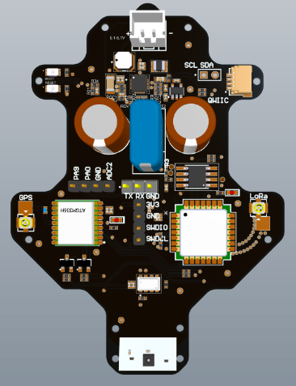

# Stratosonde Hardware

Hardware designs, schematics, and component documentation for the Stratosonde ultra-lightweight radiosonde platform.

<p align="center">
  
</p>

## Repository Structure

```
hardware/
├── schematics/     - Circuit schematics and PCB designs
│   └── v1.0/       - Version 1.0 hardware design
├── datasheets/     - Component datasheets and specifications
├── LICENSE         - MIT License
└── README.md       - This file
```

## Hardware Overview

The Stratosonde hardware is designed for:
- **Total weight**: <15 grams
- **Operating temperature**: -50°C to +60°C
- **Power**: Solar harvesting with LTO battery backup
- **Communication**: LoRaWAN (terrestrial + LEO satellite)

### Key Components

| Component | Part Number | Function |
|-----------|-------------|----------|
| **MCU** | STM32WLE5JC | Cortex-M4 @ 48MHz with integrated LoRa radio |
| **GNSS** | Quectel L96 / u-blox MAX-M10S | GPS positioning |
| **Temp/Humidity** | Sensirion SHT31 | Environmental sensing |
| **Pressure** | TE MS5607 | Altitude measurement |
| **Power Management** | Texas Instruments BQ25570 | Solar energy harvesting |
| **Battery** | 2S LTO cells | Cold-temperature energy storage |
| **Solar** | Custom PCB-integrated panels | Low-angle, diffuse light optimization |

## Schematics

Circuit schematics are organized by version:

- **v1.0**: Initial design (current)

## Datasheets

Component datasheets are stored in the `datasheets/` directory for reference during development and debugging.

## Contributing

This is an open hardware project. Contributions, suggestions, and improvements are welcome!

- **Report issues**: Use GitHub Issues
- **Propose changes**: Submit Pull Requests
- **Join discussion**: [Discord](https://discord.gg/CdqQqW7n)

## License

This hardware is licensed under the MIT License. See [LICENSE](LICENSE) for details.

## Related Repositories

- **[firmware](https://github.com/stratosonde/firmware)** - Core firmware for the radiosonde device
- **[ground](https://github.com/stratosonde/ground)** - Ground station software and tracking
- **[docs](https://github.com/stratosonde/docs)** - Technical documentation site
- **[h3lite](https://github.com/stratosonde/h3lite)** - Embedded H3 geospatial indexing
- **[.github](https://github.com/stratosonde/.github)** - Organization profile

---

**Open hardware for atmospheric science**
